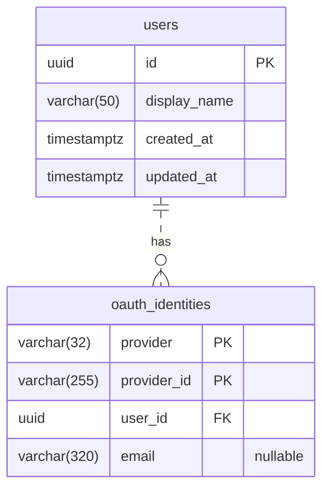

# Auth ERD

**사용자 ID는 Auth에서 UUID v7으로 생성하고, 사용자 정보와 소셜 로그인 정보를 분리한다.**
초기에는 Google 로그인을 제공하며, 계정 연결 없이 서로 다른 소셜 계정은 별도 사용자로 생성한다.
사용자 ID와 다른 서비스의 사용자 참조 컬럼은 PostgreSQL `uuid` 타입으로 통일한다.
저장 구현은 [JPA 영속성 설계](PERSISTENCE_DESIGN.md)를 따른다.

아래는 현재 코드와 V2 마이그레이션이 사용하는 구조다. 운영 DB에는 아직 V1의 빈
`users`·`auth_sessions` 테이블이 있으며, V2는 미배포 상태다.
전환 절차는 [JPA와 Flyway](../implementation/IMPLEMENTATION_NOTES.md#jpa와-flyway)를 따른다.

## 1. 초기 ERD

DB 구조는 사용자 한 명에 소셜 로그인 정보 여러 개를 저장할 수 있도록 한다.
현재 가입 흐름에서는 사용자와 소셜 로그인 정보를 하나씩 함께 생성한다.
ERD의 `0..N`은 DB에서 허용하는 관계이며, 계정 연결 기능 제공을 의미하지 않는다.

### `users` — 서비스 사용자

| 컬럼 | 타입 | 제약·용도 |
|---|---|---|
| `id` | `uuid` | PK. Auth에서 생성한 UUID v7. 다른 서비스에서도 사용하는 사용자 ID |
| `display_name` | `varchar(50)` | NOT NULL. 1~50자, 중복 허용. 사용자가 수정할 수 있는 표시 이름 |
| `created_at` | `timestamptz` | NOT NULL. 최초 가입 시각 |
| `updated_at` | `timestamptz` | NOT NULL. 사용자 정보의 마지막 수정 시각 |

### `oauth_identities` — 소셜 로그인 정보

| 컬럼 | 타입 | 제약·용도 |
|---|---|---|
| `provider` | `varchar(32)` | 복합 PK 구성. 초기 값은 `google` |
| `provider_id` | `varchar(255)` | 복합 PK 구성. 제공자가 부여한 계정 식별자. Google은 검증된 `sub` |
| `user_id` | `uuid` | NOT NULL, FK → `users.id` |
| `email` | `varchar(320)` | 제공자에게 받은 이메일. NULL 허용, UNIQUE 없음 |

`(provider, provider_id)`를 하나의 복합 PK로 사용해 같은 외부 계정의 중복 등록을 막는다.
두 컬럼 각각에 고유 제약을 두는 것은 아니다. `user_id`에는 UNIQUE 제약을 두지 않는다.
`provider`는 서버에 등록된 로그인 제공자를 구분하며, 이메일을 제공하지 않는 소셜 로그인도
추가할 수 있도록 `email`은 NULL을 허용한다.

## 2. 초기 저장 규칙

- 로그인 시 `(provider, provider_id)`로 조회한다. 기존 정보가 있으면 연결된 `user_id`를 사용한다.
- 처음 로그인한 외부 계정이면 `users`와 `oauth_identities`를 하나의 DB 트랜잭션으로 생성한다.
  사용자 ID는 Auth 애플리케이션에서 UUID v7으로 생성한다.
  동시 가입 충돌은 [영속성 설계](PERSISTENCE_DESIGN.md#동시-가입-충돌)를 따른다.
  DB 커밋 이후의 세션 저장 실패는 [로그인 실패 처리](../login/LOGIN_FLOW.md#계정-생성-후-세션-저장-실패)를 따른다.
- 제공자나 외부 계정 식별자가 다르면 새 사용자를 만든다. 이메일이 같아도 자동 연결하지 않는다.
- `provider_id`는 대소문자를 포함해 제공자의 원문을 보존한다.
  외부 계정 식별자와 이메일은 저장 전 길이를 검증하고, 제한을 초과하면 잘라 저장하지 않고 오류로 처리한다.
- 재로그인 시 인증된 제공자 응답에 이메일이 있으면 해당 `oauth_identities.email`을 최신 값으로 갱신한다.
  이메일이 누락되거나 NULL·빈 값이면 기존 값을 유지한다. 최초 가입 시 이메일이 없으면 NULL로 저장한다.
  이메일 갱신으로 사용자 ID나 외부 계정 연결을 변경하지 않으며, 사용자의 직접 수정은 허용하지 않는다.
- 표시 이름은 최초 가입 시 Google 이름으로 초기화하고, 재로그인으로 덮어쓰지 않는다.
  이름의 앞뒤 공백을 제거하고, 50자를 초과하면 앞 50자를 저장한다.
  이름이 누락되거나 NULL·공백뿐이면 기본값 `사용자`로 가입을 완료한다.
  별도 이름 입력 단계는 두지 않으며, 가입 후 사용자가 표시 이름을 수정할 수 있다.
  이메일 읽기 전용과 표시 이름 수정은 [계정 요구사항](../../../docs/CORE_FEATURE_REQUIREMENTS.md)을 따른다.
- 사용자가 표시 이름을 수정할 때는 앞뒤 공백을 제거한 뒤 1~50자인지 검증한다.
  빈 이름과 길이 초과는 오류로 처리하며, 다른 사용자와 같은 이름은 허용한다.
  표시 이름의 길이 계산과 자르기는 Unicode 코드 포인트를 기준으로 한다.
- 가입 시 두 시각을 함께 설정하고, 사용자 정보가 변경되면 `updated_at`을 갱신한다.

## 3. UUID 생성

생성기·Java 라이브러리와 UUID 바인딩은 [구현 노트](../implementation/IMPLEMENTATION_NOTES.md#사용자-uuid-생성)를 따른다.

## 4. 이후 기능

자체 로그인 자격 증명과 계정 연결은 해당 기능 도입 시 설계한다.
인증 상태 저장은 [세션 설계](../session/SESSION_DESIGN.md)와 [OAuth 임시 상태](../login/OAUTH_STATE.md)에서 관리한다.
