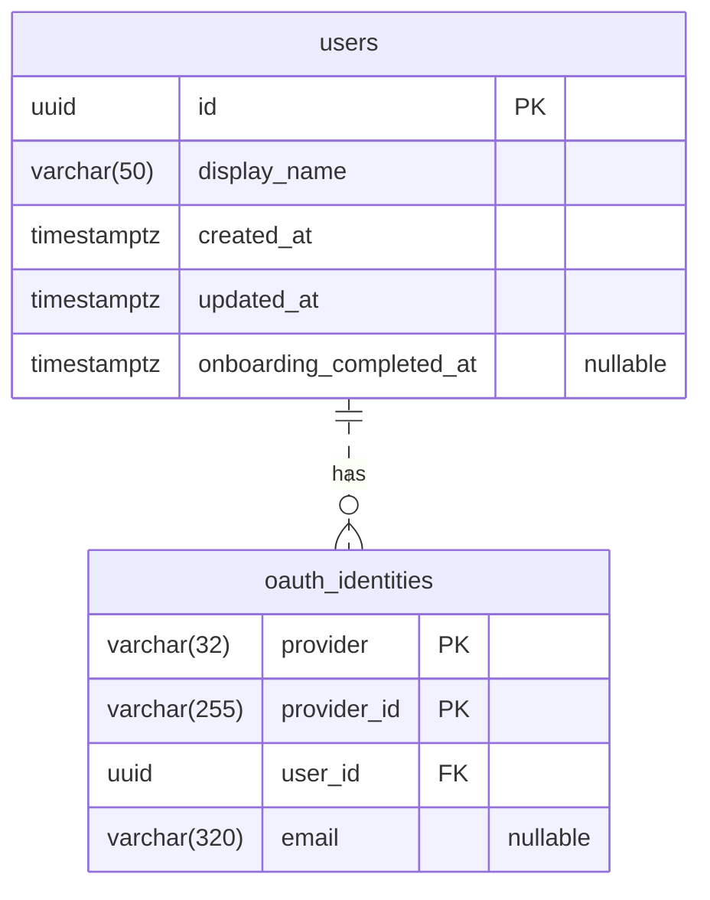

# Auth ERD

> **책임:** 계정 스키마·갱신 규칙·UUID 생성·트랜잭션·JPA 매핑·마이그레이션을 정한다.
>
> **확인할 때:** 회원정보 저장 항목을 바꾸거나 가입 충돌·계정 저장을 구현할 때.
>
> **관련 기준:** 동의 테이블과 동의 대기는 [약관 동의 설계](TERMS_CONSENT_DESIGN.md)를 본다.

**사용자 ID는 Auth에서 UUID v7으로 생성하고, 사용자 정보와 소셜 로그인 정보를 분리한다.**
현재 Google 로그인을 제공하며, 계정 연결 없이 서로 다른 소셜 계정은 별도 사용자로 생성한다.
사용자 ID와 다른 서비스의 사용자 참조 컬럼은 PostgreSQL `uuid` 타입으로 통일한다.
다른 서비스는 `users.id`를 값으로 참조하며 DB 간 외래 키는 두지 않는다.
계정 저장은 Spring Data JPA·Hibernate, 스키마 변경은 Flyway SQL로 관리한다.

아래는 현재 코드와 V2·V5 마이그레이션이 사용하는 계정 구조다.
DB 적용 전 [마이그레이션 실행 조건](#마이그레이션-실행-조건)을 확인한다.
활성 세션과 OAuth 요청은 각각 [세션 계약](../session/SESSION_DESIGN.md)과
[OAuth 임시 상태](../login/OAUTH_STATE.md)에서 관리한다.

## 1. 계정 ERD

```mermaid
erDiagram
    users ||..o{ oauth_identities : has

    users {
        uuid id PK
        varchar(50) display_name
        timestamptz created_at
        timestamptz updated_at
        timestamptz onboarding_completed_at "nullable"
    }

    oauth_identities {
        varchar(32) provider PK
        varchar(255) provider_id PK
        uuid user_id FK
        varchar(320) email "nullable"
    }
```

DB 구조는 사용자 한 명에 소셜 로그인 정보 여러 개를 저장할 수 있도록 한다.
현재 가입 흐름에서는 사용자와 소셜 로그인 정보를 하나씩 함께 생성한다.
ERD의 `0..N`은 DB에서 허용하는 관계이며, 계정 연결 기능 제공을 의미하지 않는다.

### `users` — 서비스 사용자

| 컬럼 | 타입 | 제약·용도 |
|---|---|---|
| `id` | `uuid` | PK. Auth에서 생성한 UUID v7. 다른 서비스에서도 사용하는 사용자 ID |
| `display_name` | `varchar(50)` | NOT NULL. 1~50자, 중복 허용. 사용자가 수정할 수 있는 표시 이름 |
| `created_at` | `timestamptz` | NOT NULL. 최초 가입 시각 |
| `updated_at` | `timestamptz` | NOT NULL. 사용자 정보의 마지막 수정 시각 |
| `onboarding_completed_at` | `timestamptz` | NULL 허용. 처음 온보딩을 완료한 시각. 신규 계정은 NULL |

### `oauth_identities` — 소셜 로그인 정보

| 컬럼 | 타입 | 제약·용도 |
|---|---|---|
| `provider` | `varchar(32)` | 복합 PK 구성. 초기 값은 `google` |
| `provider_id` | `varchar(255)` | 복합 PK 구성. 제공자가 부여한 계정 식별자. Google은 검증된 `sub` |
| `user_id` | `uuid` | NOT NULL, FK → `users.id` |
| `email` | `varchar(320)` | 제공자에게 받은 이메일. NULL 허용, UNIQUE 없음 |

`(provider, provider_id)`를 하나의 복합 PK로 사용해 같은 외부 계정의 중복 등록을 막는다.
두 컬럼 각각에 고유 제약을 두는 것은 아니다. `user_id`에는 UNIQUE 제약을 두지 않는다.
`provider`는 서버에 등록된 로그인 제공자를 구분하며, 이메일을 제공하지 않는 소셜 로그인도
추가할 수 있도록 `email`은 NULL을 허용한다.

## 2. 계정 저장 규칙

- 로그인 시 `(provider, provider_id)`로 조회한다. 기존 정보가 있으면 연결된 `user_id`를 사용한다.
- 처음 로그인한 외부 계정이면 `users`와 `oauth_identities`를 하나의 DB 트랜잭션으로 생성한다.
  사용자 ID는 Auth 애플리케이션에서 UUID v7으로 생성한다.
  동시 가입 충돌은 [동시 가입 충돌 규칙](#동시-가입-충돌)을 따른다.
  DB 커밋 이후의 세션 저장 실패는 [로그인 실패 처리](../login/LOGIN_FLOW.md#계정-생성-후-세션-저장-실패)를 따른다.
- 제공자나 외부 계정 식별자가 다르면 새 사용자를 만든다. 이메일이 같아도 자동 연결하지 않는다.
- `provider_id`는 대소문자를 포함해 제공자의 원문을 보존한다.
  외부 계정 식별자와 이메일은 저장 전 길이를 검증하고, 제한을 초과하면 잘라 저장하지 않고 오류로 처리한다.
- 재로그인 시 인증된 제공자 응답에 이메일이 있으면 해당 `oauth_identities.email`을 최신 값으로 갱신한다.
  이메일이 누락되거나 NULL·빈 값이면 기존 값을 유지한다. 최초 가입 시 이메일이 없으면 NULL로 저장한다.
  이메일 갱신으로 사용자 ID나 외부 계정 연결을 변경하지 않으며, 사용자의 직접 수정은 허용하지 않는다.
- 표시 이름은 최초 가입 시 Google 이름으로 초기화하고, 재로그인으로 덮어쓰지 않는다.
  이름의 앞뒤 공백을 제거하고, 50자를 초과하면 앞 50자를 저장한다.
  이름이 누락되거나 NULL·공백뿐이면 기본값 `사용자`로 가입을 완료한다.
  별도 이름 입력 단계는 두지 않으며, 가입 후 사용자가 표시 이름을 수정할 수 있다.
- 사용자가 표시 이름을 수정할 때는 앞뒤 공백을 제거한 뒤 1~50자인지 검증한다.
  빈 이름과 길이 초과는 오류로 처리하며, 다른 사용자와 같은 이름은 허용한다.
  표시 이름의 길이 계산과 자르기는 Unicode 코드 포인트를 기준으로 한다.
- 가입 시 두 시각을 함께 설정하고, 사용자 정보가 변경되면 `updated_at`을 갱신한다.
- 온보딩 완료는 `onboarding_completed_at`이 NULL일 때만 현재 시각을 기록한다.
  이미 기록된 시각은 덮어쓰지 않으며 `updated_at`도 바꾸지 않는다. 다시 보기는 값을 초기화하지 않는다.
- 회원 탈퇴는 로그인 세션 폐기를 확인한 뒤 한 트랜잭션에서 `user_terms_acceptances`,
  `oauth_identities`, `users` 순으로 해당 사용자의 행을 삭제한다. 공용 `terms_versions`는 유지한다.
  유예기간·소프트 삭제·별도 백업은 두지 않는다. 같은 외부 계정으로 다시 로그인하면 새 UUID로 가입한다.
  순서와 오류는 [회원 탈퇴 API](../API.md#회원-탈퇴)를 따른다.

## 3. 영속성

### 트랜잭션 경계

Google 통신과 신원 검증을 마친 뒤, 영속성 어댑터의 짧은 트랜잭션으로 계정을 조회·저장한다.
사용자와 소셜 정보 생성은 함께 커밋하거나 함께 롤백한다. 격리 수준은 READ COMMITTED다.
포트는 커밋 완료 후 코어 모델·조회 결과를 반환하며, JPA 엔티티를 어댑터 밖으로 노출하지 않는다.
세션 ID 생성과 Redis 저장은 DB 커밋 후 수행한다. 로그인 전체를 하나의 DB 트랜잭션으로 감싸지 않는다.

### 동시 가입 충돌

1. 동일 소셜 계정의 복합 PK 중복이면 신규 사용자·소셜 정보 생성을 모두 롤백한다.
2. 어댑터가 롤백 완료 후 중복 결과를 전달하면, 애플리케이션 서비스는 계정 포트로 기존 계정을 다시 조회한다.
3. 필요한 이메일 갱신도 새 트랜잭션에서 처리한다. 실패한 트랜잭션에서 조회를 계속하지 않는다.
4. 기존 계정을 찾지 못하거나 다른 제약·DB 오류이면 실패한다. 무한 재시도하지 않는다.

DB 커밋 후 세션 저장 실패는 [계정 유지 정책](../login/LOGIN_FLOW.md#계정-생성-후-세션-저장-실패)을 따른다.
검증 항목은 [테스트 계획](../implementation/TEST_PLAN.md#계정-저장)을 참고한다.

## 4. UUID 생성

Java 21에서는 `com.fasterxml.uuid:java-uuid-generator:5.2.0`을 사용한다.
`Generators.timeBasedEpochRandomGenerator(new SecureRandom())`를 재사용하는 생성기로 두고,
계정 생성 시 `generate()`로 UUID v7을 만든다. DB에는 문자열이 아닌 `uuid`로 바인딩한다.
같은 밀리초의 생성 순서나 여러 인스턴스 사이의 전역 순서는 보장한다고 가정하지 않는다.

라이브러리의 UUID v7 생성 API와 Java 지원 범위는
[JUG 공식 문서](https://github.com/cowtowncoder/java-uuid-generator)와
[5.2.0 릴리스 기록](https://github.com/cowtowncoder/java-uuid-generator/blob/java-uuid-generator-5.2.0/release-notes/VERSION)에서 확인했다.

## 5. JPA와 Flyway

### 의존성과 기본 설정

- `spring-boot-starter-data-jpa`를 사용하고 Hibernate·Spring Data 버전은 프로젝트의 Spring Boot BOM을 따른다.
- PostgreSQL 드라이버와 현재 HikariCP 설정은 유지한다.
- `spring.jpa.open-in-view=false`로 설정한다. 영속성 어댑터는 트랜잭션 안에서 엔티티를 코어 모델·조회 결과로 변환한다.
- `spring.jpa.hibernate.ddl-auto=validate`로 설정한다. 테이블 생성·변경은 Flyway SQL 마이그레이션으로 관리한다.
- Flyway는 `spring-boot-starter-flyway`와 PostgreSQL 지원 모듈을 사용하고 버전은 Boot가 관리한다.
  마이그레이션 경로는 `classpath:db/migration`이다. 적용한 파일은 수정하지 않고 새 버전 파일을 추가한다.
- 계정 저장은 JPA로 처리한다. DB 연결 진단의 `JdbcClient`와 책임을 구분한다.

### 마이그레이션 실행 조건

새 DB는 V1과 V2를 순서대로 실행하고, V1이 적용된 DB는 V2부터 실행한다.
V2는 기존 V1 테이블이 비어 있다는 전제이며 계정·세션 데이터 이관을 포함하지 않는다.
V2 적용 전 대상 테이블이 비어 있는지 확인한다. V1의 `uuidv7()` 때문에 PostgreSQL 18이 필요하다.

V3·V4는 약관 원문과 동의 기록을 추가한다. V5는 `users.onboarding_completed_at`을 추가하고
적용 시점의 기존 계정을 모두 `created_at`으로 채운다. 기존 회원은 온보딩을 보지 않고,
V5 이후 가입한 계정만 NULL로 시작한다.

현재 스키마는 [V2 SQL](../../src/main/resources/db/migration/V2__align_auth_accounts.sql)과
[V5 SQL](../../src/main/resources/db/migration/V5__add_user_onboarding_completion.sql)을 따른다.
검증 방식은 [테스트 계획](../implementation/TEST_PLAN.md#마이그레이션-실행-방식)에서 관리한다.

### 엔티티 매핑

| 대상 | 매핑 |
|---|---|
| `users` | `UserEntity`, `UUID` 타입 `@Id`. 생성은 ERD의 UUID v7 규칙을 사용하고 `@GeneratedValue`는 사용하지 않음 |
| `oauth_identities` | `OAuthIdentityEntity`, `@EmbeddedId`로 복합 PK 매핑 |
| 복합 키 | `OAuthIdentityId`에 `provider`, `providerId`. 두 필드 기반 `equals`·`hashCode` 구현 |
| 사용자 참조 | `@ManyToOne(fetch = LAZY, optional = false)`와 `@JoinColumn(name = "user_id", nullable = false)` |
| 생성·수정·온보딩 완료 시각 | Java `Instant`. UTC `Clock`으로 값을 설정하고 PostgreSQL `timestamptz`에 저장 |

사용자에서 소셜 정보로 향하는 역방향 컬렉션은 두지 않는다. 필요한 정보는 Repository 조회로 가져온다.
연관관계의 자동 저장·삭제 전파와 orphan removal은 사용하지 않고 두 엔티티의 저장을 명시적으로 수행한다.
컬럼명·길이·NULL 허용 여부는 명시적으로 매핑하며, 실제 제약은 Flyway에서 ERD와 동일하게 생성한다.
`oauth_identities`의 복합 PK 제약 이름은 `pk_oauth_identities`로 고정한다.

`AccountEntityMapper`가 JPA 엔티티와 코어 모델을 변환하며, 누락된 대상 필드는 컴파일 오류로 처리한다.

### 생성과 수정

UUID와 복합 키를 저장 전에 할당하므로, 신규 생성은 `AccountTransactions`의 트랜잭션 메서드에서
`EntityManager.persist()`를 호출한다. ID가 채워져 있다는 이유로 기존 엔티티로 판단해
`merge()`하는 동작에 의존하지 않는다.

조회는 Spring Data Repository를 사용하고, 수정은 쓰기 트랜잭션에서 조회한 엔티티의
변경 감지를 사용한다. 부분 필드만 채운 엔티티를 만들어 `save()`하지 않는다.
본인 계정과 이메일 조회는 DTO projection 또는 필요한 연관관계의 명시적 조회로 처리한다.
표시 이름·이메일 갱신 범위와 시각 변경은 [계정 저장 규칙](#2-계정-저장-규칙)을 따른다.
온보딩 완료는 `COALESCE`를 쓴 조건부 UPDATE로, 탈퇴는 세 테이블의 DELETE로 한 트랜잭션에서 처리한다.
영향 행 수로 계정 부재를 구분한다.

### 트랜잭션 Bean과 예외 변환

영속성 어댑터는 별도 Spring Bean의 트랜잭션 메서드를 호출한다.
이 Bean의 생성·수정 메서드에는 `@Transactional(rollbackFor = Exception.class)`,
읽기 메서드에는 `@Transactional(readOnly = true)`를 사용한다.
같은 객체 내부 호출에 의존하지 않으며, 코어의 애플리케이션 서비스에는 `@Transactional`을 붙이지 않는다.
격리 수준·커밋·반환 경계는 [영속성 설계](#트랜잭션-경계)를 따른다.

신규 계정 저장 마지막에 `flush()`로 제약 위반을 확인한다.
롤백 완료 후 SQLSTATE `23505`와 `pk_oauth_identities` 제약 이름이 함께 일치할 때만
`PortFailure.Kind.IDENTITY_ALREADY_REGISTERED`로 변환한다. 다른 무결성 오류를 동일 계정 중복으로 취급하지 않는다.

### 공식 참고

- [Spring Data JPA 신규 엔티티 판단](https://docs.spring.io/spring-data/jpa/reference/jpa/entity-persistence.html)
- [Spring 트랜잭션 전파와 rollback-only](https://docs.spring.io/spring-framework/reference/data-access/transaction/declarative/tx-propagation.html)
- [Spring Boot 데이터베이스 초기화](https://docs.spring.io/spring-boot/how-to/data-initialization.html)
